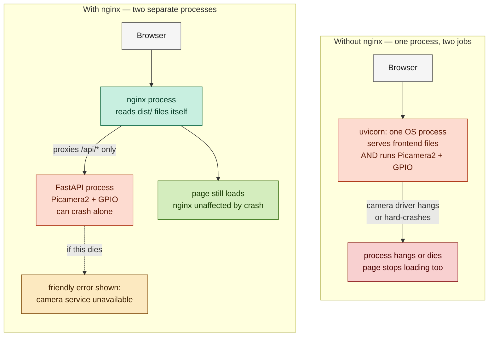

# Why I chose nginx for coloGAMA

These are my own notes on the reasoning behind putting nginx in front of the FastAPI backend, written so I can come back to this later and actually remember *why*, not just *that*.

## The situation that started this

coloGAMA runs on a Raspberry Pi 4, and I wanted to turn it from "open a terminal, run two commands" into something that just works when the Pi powers on — accessible from other devices on the network, like an IoT-ish appliance. That meant I needed something to (1) serve the built React frontend and (2) keep the FastAPI backend running and reachable, automatically, without me babysitting a terminal.

The simplest version of this is: just let FastAPI/uvicorn serve the built frontend files directly, using `StaticFiles`. One process, one port, done. And for a huge number of apps, that would genuinely be the right call — not everything needs more than that.

## Why I didn't stop there

My backend isn't a typical CRUD API. `colometry.py` does direct hardware access — it talks to the Arducam 64MP Hawkeye through `Picamera2()`, and it drives a NeoPixel LED strip through `board.D18` (a specific GPIO pin). Both of these reach past Python and into kernel drivers and physical hardware.

This matters because of something I already have first-hand proof of: getting this exact camera working was a multi-hour saga involving a missing driver, a kernel/driver version mismatch, DKMS builds, and eventually a defective ribbon cable that caused kernel-level I/O errors (`Failed to queue buffer: Input/output error`, `Device timeout detected, attempting a restart!!!`). At one point `dmesg` even showed an actual kernel-level WARNING trace from `videobuf2_core.c` — a fault below the level Python's own `try/except` can see or catch.

That history isn't hypothetical anymore. I know this hardware/driver stack can misbehave in ways that aren't clean Python exceptions.

## The actual technical mechanism (the part I kept needing to re-derive)

**Without nginx** — FastAPI/uvicorn is a single OS process. It has two jobs: serve the frontend's static files, and run the camera/GPIO logic when `/capture` is hit. Python normally runs one thing at a time on the main thread (unless you build in concurrency). If the camera call hangs waiting on the driver, the *whole process* is busy — including the part that would otherwise serve `index.html` to someone else. If it fails hard enough to crash the process outright (a segfault in a C extension, a fatal kernel-driver fault), there's no process left running at all — nothing serves the page, period.

**With nginx** — nginx is a *separate* OS process from uvicorn. It reads the built frontend files off disk itself and hands them to browsers with zero dependency on the FastAPI process being alive. It only talks to FastAPI for `/api/*` requests, over a local proxy connection. If the backend process hangs or dies, nginx doesn't hang or die with it — it just gets connection failures on the `/api/` requests and can return a clean `502` for those specific calls, while everything else (the page itself, its layout, its JS) keeps loading normally.

The short version I want to remember: **one process means one job's failure mode becomes the other job's failure mode too.** nginx breaks that coupling.

### Visual — the two scenarios side by side

*(Renders natively on GitHub, GitLab, and most modern markdown viewers/editors with mermaid support — no plugin needed.)*

## Why this is "hang or crash," not just "returns an error"

This was the part that took me longest to actually feel, not just know. A normal software bug (bad query, missing field, whatever) raises a Python exception, FastAPI catches it, turns it into a `500`, and the process survives untouched — that's the gentle, expected failure mode most backends deal with.

Hardware-level failure is a different category. It can happen *below* Python — in a kernel module, a C extension, a driver — somewhere a Python `try/except` was never able to reach in the first place. That's not "the code has a bug," that's "the operating system itself is having a bad time," and the blast radius of that is the whole process, not just one request.

## What this buys me, concretely

- The site stays reachable and functional-looking even during a backend crash or restart (systemd's `Restart=on-failure` handles the "bring it back" part; nginx handles the "stay up while it's down" part)
- Because the page survives, the frontend can actually catch the failed `/api/` call and show something a normal person understands ("the camera service isn't responding, please wait a few seconds and try again") instead of a blank tab or a browser-level network error
- Process isolation is a general systems principle, not an nginx-specific trick — same reasoning as keeping unrelated critical systems on separate hardware/processes so one failure doesn't cascade into another

## What this costs me (the honest tradeoffs)

- **One more moving part.** Now there are two services to keep running (nginx + the FastAPI systemd service) instead of one. More surface area, in principle, for something to be misconfigured.
- **One more config file to maintain.** The nginx site config needs to stay in sync if I ever change ports, paths, or add new route prefixes.
- **It's not actually required at my current scale.** I want to be honest with myself about this: for a handful of devices hitting a local Pi occasionally, raw uvicorn serving static files directly would probably never show a *performance* problem. This decision is about resilience and failure isolation, not speed, not "handling more traffic," and not because nginx is somehow the "proper" or "professional" way — it's specifically because *my* backend does something riskier than typical backend code does.
- **Slightly more to explain and defend.** If someone asks "why nginx for a device this small," the honest answer isn't "best practice" — it's the specific chain above. If I can't explain that chain, I probably shouldn't lean on "it's standard" as the reason, since that's not really *my* reason.

## The one-sentence version I want to be able to say out loud

"nginx puts static file serving in a separate OS process from my application logic, so a crash or hang in the FastAPI process — which does direct hardware access to a camera and GPIO that I've already seen fail at the driver level — doesn't take down the page itself. The site stays reachable, and the frontend can show a clear error instead of just going dark."

## If I ever revisit this decision

Worth reconsidering if:
- I stop doing direct hardware access in the request path (e.g. if capture logic moves to a separate worker process/queue instead of running inline during the HTTP request) — the core risk this whole decision is protecting against would be gone
- The deployment target changes to something where a single extra process genuinely isn't worth the complexity (e.g. a much more constrained device)

Worth keeping firmly if:
- The camera/GPIO code stays inline in the request-handling path, since that's the exact condition that makes process isolation matter here