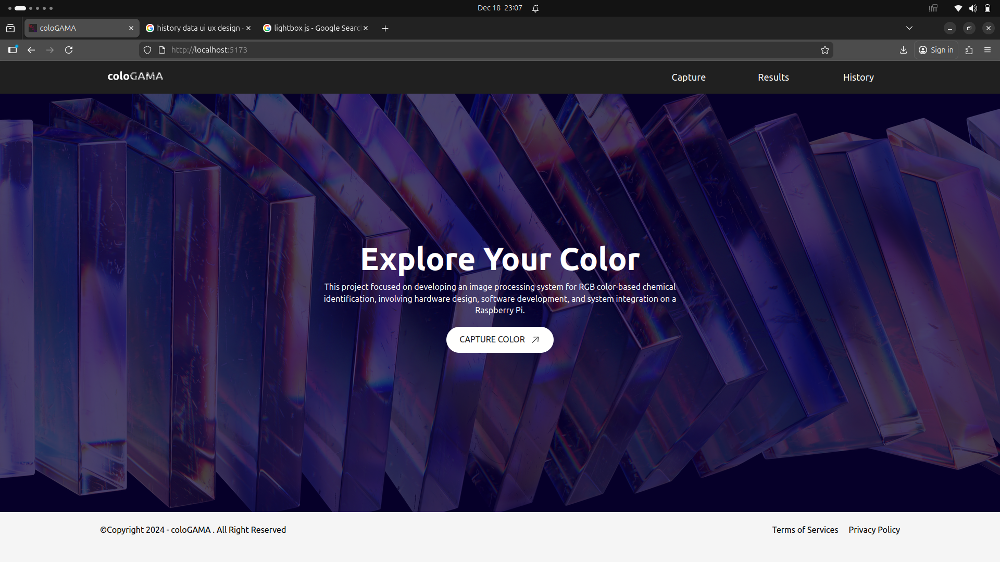
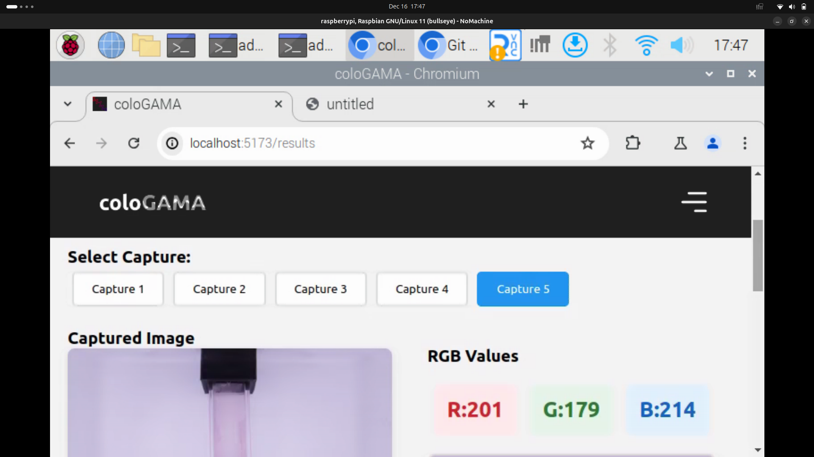
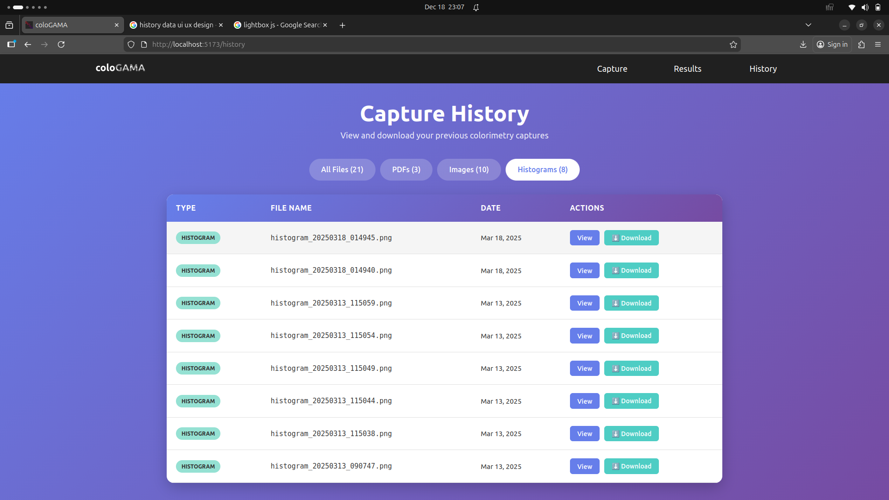

# coloGAMA

<div align="center">


**Advanced Colorimetry Analysis System for Chemical Identification**

A web-based RGB color analysis system powered by Raspberry Pi and computer vision for precise chemical identification through colorimetric measurements.

[](https://opensource.org/licenses/MIT)
[](https://www.python.org/)
[](https://reactjs.org/)
[](https://fastapi.tiangolo.com/)

[Features](#features) • [Hardware](#hardware-requirements) • [Installation](#installation) • [Usage](#usage) • [API](#api-documentation)

</div>

---

## 📋 Table of Contents

- [Overview](#overview)
- [Features](#features)
- [Hardware Requirements](#hardware-requirements)
- [Software Stack](#software-stack)
- [Installation](#installation)
- [Usage](#usage)
- [API Documentation](#api-documentation)
- [Project Structure](#project-structure)
- [Screenshots](#screenshots)
- [Troubleshooting](#troubleshooting)
- [Contributing](#contributing)
- [License](#license)
- [Authors](#authors)

---

## 🎯 Overview

**coloGAMA** is an image processing system designed for RGB color-based chemical identification. The system captures multiple images under controlled lighting conditions, performs colorimetric analysis, and generates comprehensive reports with RGB values and histograms.

This project integrates:
- **Hardware Design**: Custom camera setup with Raspberry Pi
- **Software Development**: Web-based interface for real-time analysis
- **System Integration**: Seamless communication between frontend and backend

### Key Capabilities

- 📸 **Automated Image Capture**: Sequential capture of 5 images with precise timing
- 🎨 **RGB Analysis**: Extract and analyze average RGB values from cropped regions
- 📊 **Histogram Generation**: Visualize color distribution across all channels
- 📄 **PDF Report Generation**: Comprehensive reports with images, histograms, and RGB data
- 🌐 **Web Interface**: User-friendly dashboard for control and visualization
- 📚 **History Management**: Browse, view, and download past analyses

---

## ✨ Features

### Core Functionality

- ✅ **Real-time Color Capture**: Automated capture with ArduCam camera module
- ✅ **RGB Value Extraction**: Precise average RGB calculation from defined regions
- ✅ **Multi-Channel Histograms**: Separate histogram analysis for R, G, B channels
- ✅ **PDF Report Generation**: Professional reports with embedded images and data
- ✅ **Responsive Web Interface**: Access from any device on the network
- ✅ **History Browser**: View and download all past analyses
- ✅ **LED Lighting Control**: NeoPixel LED ring for consistent illumination

### Technical Features

- 🔄 **Auto-start on Boot**: Services automatically start with Raspberry Pi
- 🖼️ **PDF.js Viewer**: In-browser PDF viewing with fallback to iframe
- 📱 **Mobile Responsive**: Works on tablets and mobile devices
- 🎯 **Image Cropping**: Focus on specific region of interest (160x360px)
- ⚡ **Fast Processing**: Results available in ~30 seconds
- 💾 **Persistent Storage**: All data saved locally with timestamps

---

## 🛠️ Hardware Requirements

### Main Components

| Component | Model/Spec | Purpose |
|-----------|-----------|---------|
| **SBC** | Raspberry Pi 5 (4GB RAM) | Main processing unit |
| **Camera** | ArduCam IMX519 (16MP) | High-resolution image capture |
| **Lighting** | NeoPixel LED Ring (7 LEDs) | Consistent illumination |
| **Power Supply** | 5V 3A USB-C | Power for Raspberry Pi |
| **Storage** | microSD Card (32GB+) | OS and data storage |

### Optional Components

- **Case**: Custom 3D-printed enclosure for camera and LED setup
- **Cooling**: Heatsink or fan for Raspberry Pi (recommended)
- **Display**: HDMI monitor for initial setup (optional after configuration)

### Wiring Diagram

```
Raspberry Pi GPIO Layout:
┌─────────────────────────────┐
│  GPIO 18 (Pin 12) → NeoPixel Data
│  5V Power       → NeoPixel VCC
│  GND            → NeoPixel GND
│  CSI Port       → ArduCam Ribbon Cable
└─────────────────────────────┘
```

---

## 💻 Software Stack

### Frontend
- **Framework**: React 18+
- **Styling**: Tailwind CSS
- **Routing**: React Router v6
- **Charts**: Chart.js with react-chartjs-2
- **PDF Viewer**: react-pdf (PDF.js)
- **Build Tool**: Vite

### Backend
- **Framework**: FastAPI (Python 3.9+)
- **Image Processing**: OpenCV (cv2)
- **Camera Control**: Picamera2
- **Visualization**: Matplotlib
- **PDF Generation**: ReportLab
- **LED Control**: Adafruit NeoPixel
- **Server**: Uvicorn (ASGI)

### System
- **OS**: Raspberry Pi OS (64-bit, Debian-based)
- **Runtime**: Node.js 18+, Python 3.9+
- **Process Management**: systemd / custom bash scripts

---

## 🚀 Installation

### Prerequisites

1. **Raspberry Pi Setup**
   ```bash
   # Update system
   sudo apt update && sudo apt upgrade -y
   
   # Install system dependencies
   sudo apt install -y python3-pip python3-venv nodejs npm git
   ```

2. **Enable Camera**
   ```bash
   sudo raspi-config
   # Navigate to: Interface Options → Camera → Enable
   sudo reboot
   ```

### Backend Setup

```bash
# Clone repository
cd ~/Documents
git clone https://github.com/jakditstudio/coloGAMA.git
cd coloGAMA/backend

# Create virtual environment
python3 -m venv .venv
source .venv/bin/activate

# Install Python dependencies
pip install --upgrade pip
pip install fastapi uvicorn picamera2 opencv-python-headless matplotlib reportlab
pip install adafruit-circuitpython-neopixel

# Test camera
python -c "from picamera2 import Picamera2; print('Camera OK')"
```

### Frontend Setup

```bash
# Navigate to frontend
cd ~/Documents/coloGAMA/frontend

# Install dependencies
npm install

# Test build
npm run build
```

### Auto-Start Configuration

#### Option 1: Bash Scripts (Simple)

```bash
# Create start script
nano ~/start-cologama.sh
```

Paste this content:

```bash
#!/bin/bash

echo "Starting coloGAMA services..."

# Kill any existing processes first
sudo pkill -f "python main.py" 2>/dev/null
pkill -f "npm run dev" 2>/dev/null
sleep 2

# Start backend in background
echo "Starting backend..."
cd /home/admin/Documents/coloGAMA/backend
nohup sudo python main.py > /tmp/cologama-backend.log 2>&1 &
BACKEND_PID=$!
echo "Backend started with PID: $BACKEND_PID"

# Wait for backend to start
sleep 5

# Start frontend in background
echo "Starting frontend..."
cd /home/admin/Documents/coloGAMA/frontend
nohup npm run dev -- --host 0.0.0.0 > /tmp/cologama-frontend.log 2>&1 &
FRONTEND_PID=$!
echo "Frontend started with PID: $FRONTEND_PID"

# Save PIDs
echo $BACKEND_PID > /tmp/cologama-backend.pid
echo $FRONTEND_PID > /tmp/cologama-frontend.pid

echo "✓ coloGAMA services started!"
echo "Access at: http://localhost:5173"
```

```bash
# Make executable
chmod +x ~/start-cologama.sh

# Add to crontab for auto-start
crontab -e
# Add this line:
@reboot /home/admin/start-cologama.sh

# Create stop script
nano ~/stop-cologama.sh
```

Paste stop script content:

```bash
#!/bin/bash

echo "Stopping coloGAMA services..."

if [ -f /tmp/cologama-backend.pid ]; then
    BACKEND_PID=$(cat /tmp/cologama-backend.pid)
    sudo kill $BACKEND_PID 2>/dev/null
    rm /tmp/cologama-backend.pid
fi

if [ -f /tmp/cologama-frontend.pid ]; then
    FRONTEND_PID=$(cat /tmp/cologama-frontend.pid)
    kill $FRONTEND_PID 2>/dev/null
    rm /tmp/cologama-frontend.pid
fi

sudo pkill -f "python main.py" 2>/dev/null
pkill -f "npm run dev" 2>/dev/null

echo "✓ coloGAMA services stopped!"
```

```bash
chmod +x ~/stop-cologama.sh
```

#### Option 2: Systemd Services (Production)

See [docs/systemd-setup.md](docs/systemd-setup.md) for systemd configuration.

---

## 📖 Usage

### Starting the System

```bash
# Manual start
~/start-cologama.sh

# Or if using systemd
sudo systemctl start cologama-backend cologama-frontend
```

### Accessing the Interface

1. **On Raspberry Pi**:
   - Open Chromium browser
   - Navigate to: `http://localhost:5173`

2. **From Another Device**:
   - Find Raspberry Pi IP: `hostname -I`
   - Navigate to: `http://192.168.x.x:5173`

### Capturing Images

1. Click **"CAPTURE COLOR"** button on home page
2. Wait for 5 sequential captures (~30 seconds)
3. View results automatically displayed
4. Review RGB values, histograms, and captured images
5. Download PDF report if needed

### Viewing History

1. Navigate to **"History"** page
2. Filter by file type (All, PDFs, Images, Histograms)
3. Click **"View"** to preview files in browser
4. Click **"Download"** to save files locally

### Stopping the System

```bash
# Manual stop
~/stop-cologama.sh

# Or if using systemd
sudo systemctl stop cologama-backend cologama-frontend
```

---

## 📡 API Documentation

### Base URL
```
http://localhost:8000
```

### Endpoints

#### `GET /`
Health check endpoint.

**Response:**
```json
{
  "message": "Colometry API is running!"
}
```

#### `POST /capture`
Trigger a new colorimetry capture sequence.

**Response:**
```json
{
  "message": "Colometry process completed successfully.",
  "pdf_url": "http://localhost:8000/files/pdf/output_20251219_123456.pdf",
  "captures": [
    {
      "capture_number": 1,
      "timestamp": "20251219_123456",
      "image_url": "/files/captures_image/captured_image_20251219_123456.jpg",
      "histogram_url": "/files/histogram/histogram_20251219_123456.png",
      "rgb_values": {
        "R": 203,
        "G": 177,
        "B": 214
      },
      "histogram_data": {
        "red": [/* 256 values */],
        "green": [/* 256 values */],
        "blue": [/* 256 values */]
      }
    }
    // ... 4 more captures
  ]
}
```

#### `GET /history`
Get list of all historical captures.

**Response:**
```json
{
  "pdfs": [
    {
      "name": "output_20251219_123456.pdf",
      "url": "http://localhost:8000/history/pdf/output_20251219_123456.pdf"
    }
  ],
  "images": [/* ... */],
  "histograms": [/* ... */]
}
```

#### `GET /files/{file_path}`
Serve static files (images, PDFs, histograms).

#### `GET /history/pdf/{filename}`
Get specific PDF file.

#### `GET /history/image/{filename}`
Get specific image file.

#### `GET /history/histogram/{filename}`
Get specific histogram file.

---

## 📁 Project Structure

```
coloGAMA/
├── backend/
│   ├── main.py                 # FastAPI server
│   ├── colometry.py            # Image capture & processing logic
│   ├── requirements.txt        # Python dependencies
│   └── history/                # Output directory
│       ├── captures_image/     # Captured images
│       ├── histogram/          # Histogram PNGs
│       └── pdf/                # Generated PDF reports
│
├── frontend/
│   ├── src/
│   │   ├── Components/
│   │   │   ├── Hero/           # Landing page
│   │   │   ├── Results/        # Results display
│   │   │   ├── NavBar/
│   │   │   │   └── History/    # History browser
│   │   │   └── Footer/
│   │   ├── App.jsx             # Main app component
│   │   ├── main.jsx            # Entry point
│   │   └── index.css           # Global styles
│   ├── package.json            # NPM dependencies
│   └── vite.config.js          # Vite configuration
│
├── start-cologama.sh           # Start script
├── stop-cologama.sh            # Stop script
├── README.md                   # This file
└── LICENSE                     # MIT License
```

---

## 📸 Screenshots

### Home Page

*Landing page with capture button*

### Results Page

*RGB values, captured images, and histograms*

### History Browser

*Browse and view past analyses*

---

## 🐛 Troubleshooting

### Camera Not Detected

```bash
# Check camera connection
vcgencmd get_camera

# Should output: supported=1 detected=1

# Test with libcamera
libcamera-hello
```

### Permission Denied Errors

```bash
# Add user to required groups
sudo usermod -aG video,gpio,i2c $USER

# Reboot to apply
sudo reboot
```

### LED Not Working

```bash
# Check GPIO permissions
sudo chown root:gpio /dev/gpiomem
sudo chmod g+rw /dev/gpiomem

# Run backend with sudo
sudo python main.py
```

### Port Already in Use

```bash
# Find and kill process on port 8000
sudo lsof -ti:8000 | xargs kill -9

# Find and kill process on port 5173
lsof -ti:5173 | xargs kill -9
```

### Frontend Won't Start

```bash
# Clear npm cache
npm cache clean --force

# Reinstall dependencies
rm -rf node_modules package-lock.json
npm install
```

### View Logs

```bash
# Backend logs
tail -f /tmp/cologama-backend.log

# Frontend logs
tail -f /tmp/cologama-frontend.log
```

---

## 🤝 Contributing

Contributions are welcome! Please follow these steps:

1. Fork the repository
2. Create a feature branch (`git checkout -b feature/AmazingFeature`)
3. Commit your changes (`git commit -m 'Add some AmazingFeature'`)
4. Push to the branch (`git push origin feature/AmazingFeature`)
5. Open a Pull Request

### Development Guidelines

- Follow PEP 8 for Python code
- Use ESLint for JavaScript code
- Write descriptive commit messages
- Add comments for complex logic
- Update documentation for new features

---

## 📄 License

This project is licensed under the MIT License - see the [LICENSE](LICENSE) file for details.

---

## 👥 Authors

- **Abyan Raditya Raka Pasha** - [Xiation](https://github.com/Xiation)
- **Dzaky Radhitya Abimanyu** - [dzakyradithyaa](https://github.com/dzakyradithyaa)

### Acknowledgments

- Raspberry Pi Foundation for hardware support
- ArduCam for camera modules
- FastAPI and React communities
- OpenCV contributors

---

## 📞 Support

For support, email abyanradityarakapasha@mail.ugm.ac.id or open an issue on GitHub.

---

## 🗺️ Roadmap

- [ ] Machine learning for chemical classification
- [ ] Multi-language support
- [ ] Cloud storage integration
- [ ] Mobile app version
- [ ] Real-time video streaming
- [ ] Database integration (PostgreSQL)
- [ ] User authentication
- [ ] Batch processing mode
- [ ] Export to CSV/Excel
- [ ] Calibration wizard

---

<div align="center">

**Made with ❤️ for Chemical Analysis**

</div>