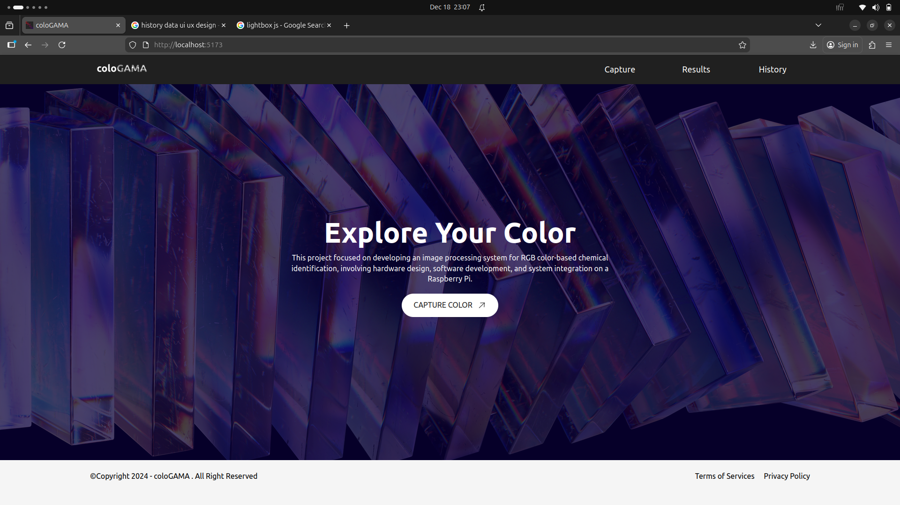
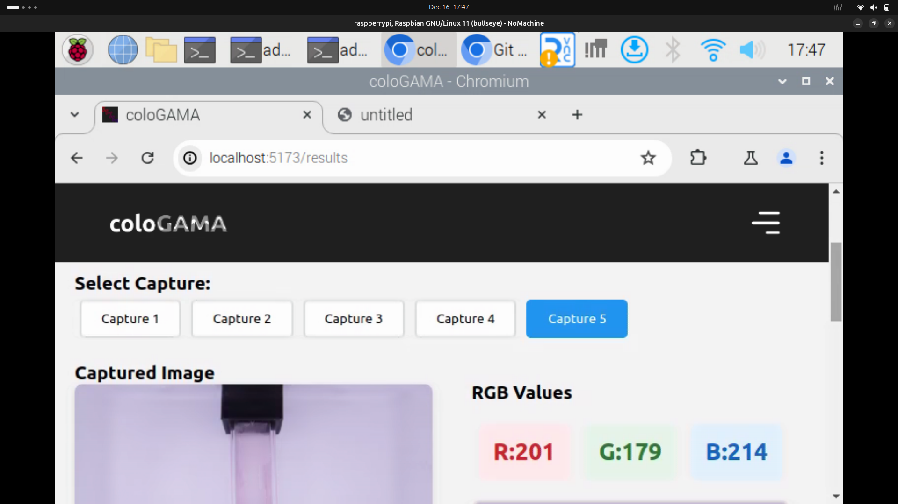
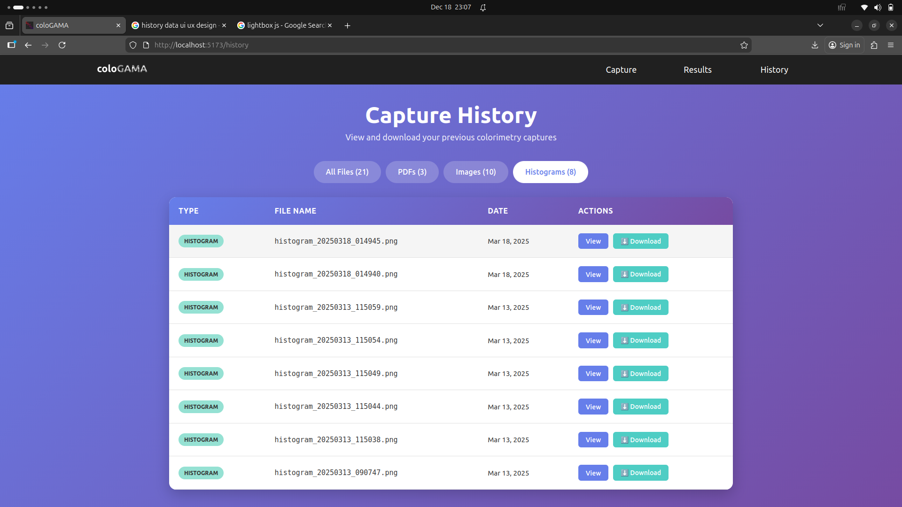

# coloGAMA

<div align="center">


**Advanced Colorimetry Analysis System for Chemical Identification**

A web-based RGB color analysis system powered by Raspberry Pi and computer vision for precise chemical identification through colorimetric measurements.

[](https://opensource.org/licenses/MIT)
[](https://www.python.org/)
[](https://reactjs.org/)
[](https://fastapi.tiangolo.com/)

[Features](#features) • [Hardware](#hardware-requirements) • [Installation](#installation) • [Usage](#usage) • [API](#api-documentation)

</div>

---

## 📋 Table of Contents

- [Overview](#overview)
- [Features](#features)
- [Hardware Requirements](#hardware-requirements)
- [Software Stack](#software-stack)
- [Installation](#installation)
- [Usage](#usage)
- [API Documentation](#api-documentation)
- [Project Structure](#project-structure)
- [Screenshots](#screenshots)
- [Troubleshooting](#troubleshooting)
- [Contributing](#contributing)
- [License](#license)
- [Authors](#authors)

---

## 🎯 Overview

**coloGAMA** is an image processing system designed for RGB color-based chemical identification. The system captures multiple images under controlled lighting conditions, performs colorimetric analysis, and generates comprehensive reports with RGB values and histograms.

This project integrates:
- **Hardware Design**: Custom camera setup with Raspberry Pi
- **Software Development**: Web-based interface for real-time analysis
- **System Integration**: Seamless communication between frontend and backend

### Key Capabilities

- 📸 **Automated Image Capture**: Sequential capture of 5 images with precise timing
- 🎨 **RGB Analysis**: Extract and analyze average RGB values from cropped regions
- 📊 **Histogram Generation**: Visualize color distribution across all channels
- 📄 **PDF Report Generation**: Comprehensive reports with images, histograms, and RGB data
- 🌐 **Web Interface**: User-friendly dashboard for control and visualization
- 📚 **History Management**: Browse, view, and download past analyses

---

## ✨ Features

### Core Functionality

- ✅ **Real-time Color Capture**: Automated capture with ArduCam camera module
- ✅ **RGB Value Extraction**: Precise average RGB calculation from defined regions
- ✅ **Multi-Channel Histograms**: Separate histogram analysis for R, G, B channels
- ✅ **PDF Report Generation**: Professional reports with embedded images and data
- ✅ **Responsive Web Interface**: Access from any device on the network
- ✅ **History Browser**: View and download all past analyses
- ✅ **LED Lighting Control**: NeoPixel LED ring for consistent illumination
- ✅ **Real-Time Video Streaming**: Live camera positioning preview on the Dashboard before capture (MJPEG stream, mutually exclusive with capture)

### Technical Features

- 🔄 **Auto-start on Boot**: Services automatically start with Raspberry Pi
- 🖼️ **PDF.js Viewer**: In-browser PDF viewing with fallback to iframe
- 📱 **Mobile Responsive**: Works on tablets and mobile devices
- 🎯 **Image Cropping**: Focus on specific region of interest (160x360px)
- ⚡ **Fast Processing**: Results available in ~30 seconds
- 💾 **Persistent Storage**: All data saved locally with timestamps

---

## 🛠️ Hardware Requirements

### Main Components

| Component | Model/Spec | Purpose |
|-----------|-----------|---------|
| **SBC** | Raspberry Pi 5 (4GB RAM) | Main processing unit |
| **Camera** | ArduCam IMX519 (16MP) | High-resolution image capture |
| **Lighting** | NeoPixel LED Ring (7 LEDs) | Consistent illumination |
| **Power Supply** | 5V 3A USB-C | Power for Raspberry Pi |
| **Storage** | microSD Card (32GB+) | OS and data storage |

### Optional Components

- **Case**: Custom 3D-printed enclosure for camera and LED setup
- **Cooling**: Heatsink or fan for Raspberry Pi (recommended)
- **Display**: HDMI monitor for initial setup (optional after configuration)

### Wiring Diagram

```
Raspberry Pi GPIO Layout:
┌─────────────────────────────┐
│  GPIO 18 (Pin 12) → NeoPixel Data
│  5V Power       → NeoPixel VCC
│  GND            → NeoPixel GND
│  CSI Port       → ArduCam Ribbon Cable
└─────────────────────────────┘
```

---

## 💻 Software Stack

### Frontend
- **Framework**: React 18+
- **Styling**: Tailwind CSS
- **Routing**: React Router v6
- **Charts**: Chart.js with react-chartjs-2
- **PDF Viewer**: react-pdf (PDF.js)
- **Build Tool**: Vite

### Backend
- **Framework**: FastAPI (Python 3.9+)
- **Image Processing**: OpenCV (cv2)
- **Camera Control**: Picamera2
- **Visualization**: Matplotlib
- **PDF Generation**: ReportLab
- **LED Control**: Adafruit NeoPixel
- **Server**: Uvicorn (ASGI)

### System
- **OS**: Raspberry Pi OS (64-bit, Debian-based)
- **Runtime**: Node.js 18+, Python 3.9+
- **Web Server / Reverse Proxy**: nginx (serves built frontend, proxies `/api/` to backend)
- **Process Management**: systemd (backend auto-start + auto-restart)

---

## 🚀 Installation

### Prerequisites

1. **Raspberry Pi Setup**
   ```bash
   # Update system
   sudo apt update && sudo apt upgrade -y
   
   # Install system dependencies
   sudo apt install -y python3-pip python3-venv nodejs npm git
   ```

2. **Enable Camera**
   ```bash
   sudo raspi-config
   # Navigate to: Interface Options → Camera → Enable
   sudo reboot
   ```

### Backend Setup

```bash
# Clone repository
cd ~
git clone https://github.com/jakditstudio/coloGAMA.git
cd coloGAMA/backend

# Create virtual environment with access to system packages
# (needed for apt-installed picamera2/libcamera bindings — pip's picamera2
# wheel alone has no libcamera bindings, see Troubleshooting)
python3 -m venv --system-site-packages .venv
source .venv/bin/activate

# Install Python dependencies (versions pinned in requirements.txt)
pip install --upgrade pip
pip install -r requirements.txt

# picamera2's libcamera bindings must come from apt, not pip
sudo apt install -y python3-picamera2 python3-libcamera

# Test camera
python -c "from picamera2 import Picamera2; print('Camera OK')"

# Once the camera is confirmed working, HOLD these packages so a future
# `apt upgrade` can't silently break camera detection — see Troubleshooting
# "Camera worked yesterday, suddenly stops being detected" below for why.
dpkg -l | grep -iE "libcamera|rpicam"   # find your exact installed package names first
sudo apt-mark hold python3-libcamera python3-picamera2 libcamera0.3 rpicam-apps   # adjust names to match the above
```

> **Hold the camera stack once it works.** `sudo apt upgrade` bumping `libcamera`/`rpicam-apps` to a newer version has broken camera detection in the field with zero hardware changes involved — confirmed, not hypothetical (see Troubleshooting). Run `apt-mark hold` on the camera-related packages immediately after confirming `Camera OK` above, before anyone runs a routine `apt upgrade` later and loses camera detection without realizing why.

> **Consistent paths matter.** Whatever path you clone into (`~/coloGAMA` above), use that exact same path everywhere later — nginx's `root`, and the systemd service's `WorkingDirectory`/`ExecStart`. A mismatched path (leftover `Documents/`, wrong username) is the most common cause of both nginx 500s and systemd failing to start.

### Frontend Setup

```bash
# Navigate to frontend
cd ~/coloGAMA/frontend

# Install dependencies
npm install

# Test build
npm run build
```

### Auto-Start Configuration (Production: nginx + systemd)

coloGAMA runs in production as two decoupled services: **nginx** serves the built frontend and reverse-proxies `/api/` to the backend, while **systemd** keeps the FastAPI backend running and auto-restarting. This replaces the old bash-script + crontab approach — nginx stays up and keeps serving the page even if the backend crashes or is mid-restart, instead of the whole site going down with it. See [docs/plan/coloGAMA-deployment-plan-revised.md](docs/plan/coloGAMA-deployment-plan-revised.md) and [docs/plan/why-nginx-for-cologama.md](docs/plan/why-nginx-for-cologama.md) for the full reasoning and step-by-step.

**Build the frontend for production:**
```bash
cd ~/coloGAMA/frontend
npm install
npm run build
```
This produces `frontend/dist/` — static HTML/CSS/JS, no dev server needed at runtime.

**Install and configure nginx:**
```bash
sudo apt install -y nginx
sudo nano /etc/nginx/sites-available/cologama
```

```nginx
server {
    listen 80;
    server_name _;

    root /home/<your-user>/coloGAMA/frontend/dist;
    index index.html;

    location / {
        try_files $uri $uri/ /index.html;
    }

    location /api/ {
        proxy_pass http://127.0.0.1:8000;
        proxy_set_header Host $host;
        proxy_set_header X-Real-IP $remote_addr;
        proxy_set_header X-Forwarded-For $proxy_add_x_forwarded_for;
        proxy_set_header X-Forwarded-Proto $scheme;
    }
}
```

```bash
sudo ln -s /etc/nginx/sites-available/cologama /etc/nginx/sites-enabled/
sudo rm -f /etc/nginx/sites-enabled/default
sudo nginx -t
sudo systemctl restart nginx
sudo systemctl enable nginx
```

> **Watch out for placeholder paths.** Every `admin` / `/home/admin/...` in example configs must be swapped for your actual Pi username — a leftover `admin` reference in `User=`, `WorkingDirectory=`, `ExecStart=`, or nginx's `root` is the #1 cause of a service failing to start or nginx returning 500.
>
> **Watch out for home directory permissions too.** Pi OS defaults `/home/<user>` to `750` — nginx runs as `www-data` and can't traverse into your home folder to read `dist/` unless you open it up:
> ```bash
> chmod o+x ~ ~/coloGAMA ~/coloGAMA/frontend
> chmod -R o+rX ~/coloGAMA/frontend/dist
> ```
> A `500 Internal Server Error` with `rewrite or internal redirection cycle` + `Permission denied` in `/var/log/nginx/error.log` is this exact issue.

**Backend as a systemd service:**
```bash
sudo nano /etc/systemd/system/cologama-backend.service
```

```ini
[Unit]
Description=coloGAMA FastAPI Backend
After=network.target

[Service]
Type=simple
User=<your-user>
Group=<your-user>
WorkingDirectory=/home/<your-user>/coloGAMA/backend
ExecStart=/home/<your-user>/coloGAMA/backend/<venv-name>/bin/python main.py
Restart=on-failure
RestartSec=5

[Install]
WantedBy=multi-user.target
```

```bash
sudo systemctl daemon-reload
sudo systemctl enable cologama-backend
sudo systemctl start cologama-backend
sudo systemctl status cologama-backend
```

Should show `active (running)`. If it fails, check logs:
```bash
sudo journalctl -u cologama-backend -f
```

**Remove the old crontab auto-start**, if you'd set one up previously:
```bash
crontab -e
# delete: @reboot /home/<your-user>/start-cologama.sh
```

---

## 📖 Usage

### Connecting via Phone Hotspot (Field / Remote Use)

For field use away from a fixed wifi network, connect the Pi to a phone hotspot so any other device (phone, laptop) on that same hotspot can reach the web interface.

**1. On the phone, create a mobile hotspot:**
- Name (SSID): `cologama`
- Password: `cologama123`

(Android: Settings → Connections/Network & Internet → Hotspot & Tethering → Wi-Fi Hotspot, set name/password there. iOS: Settings → Personal Hotspot.)

**2. Connect the Pi to it**, either via desktop wifi menu, or headless over SSH:
```bash
sudo raspi-config
# System Options → Wireless LAN → enter SSID "cologama" and password "cologama123"
```
or with `nmcli` (NetworkManager, default on recent Pi OS):
```bash
sudo nmcli device wifi connect "cologama" password "cologama123"
```

**3. Confirm the Pi connected:**
```bash
iwgetid   # should show ESSID:"cologama"
```

**4. From any other device connected to the same `cologama` hotspot**, open:
```
http://raspberrypi.local/
```
(See [Accessing the Interface](#accessing-the-interface) below — mDNS makes this work even if the Pi's IP changes across hotspot sessions, as covered by the `.local` fallback there.)

> ⚠️ **Security note:** `cologama123` is a weak, predictable password for a network you may use in shared/public field settings. Anyone who guesses or is told the SSID+password gets full LAN access to the Pi (and, since it's still `allow_origins=["*"]` in CORS, to the API too). Fine for quick internal testing; if this hotspot is used somewhere less trusted, swap in a stronger, non-guessable password.

### Starting the System

Both services auto-start on boot. To manage them manually:

```bash
sudo systemctl start cologama-backend
sudo systemctl start nginx
```

### Accessing the Interface

nginx serves everything on port 80 — no port number needed, and no dev server to start manually.

1. **On Raspberry Pi**:
   - Open Chromium browser
   - Navigate to: `http://localhost/`

2. **From Another Device** (recommended — works even if the Pi's IP changes, e.g. switching wifi/hotspot):
   - Navigate to: `http://raspberrypi.local/`
   - Requires `avahi-daemon` running on the Pi (`systemctl status avahi-daemon` — usually preinstalled) and mDNS support on the connecting device (works out of the box on macOS/iOS/Linux; on Android, use Chrome for best support)
   - If `.local` doesn't resolve on a given device, fall back to the IP: find it with `hostname -I` on the Pi, then navigate to `http://192.168.x.x/`

### Capturing Images

1. Click **"CAPTURE COLOR"** button on home page
2. Wait for 5 sequential captures (~30 seconds)
3. View results automatically displayed
4. Review RGB values, histograms, and captured images
5. Download PDF report if needed

### Viewing History

1. Navigate to **"History"** page
2. Filter by file type (All, PDFs, Images, Histograms)
3. Click **"View"** to preview files in browser
4. Click **"Download"** to save files locally

### Stopping the System

```bash
sudo systemctl stop cologama-backend
sudo systemctl stop nginx
```

---

## 📡 API Documentation

### Base URL

In production, all backend routes are mounted under `/api` and reached through nginx's reverse proxy on port 80 — you should never hit port 8000 directly from a browser or the frontend:
```
http://<pi-ip>/api
```
(FastAPI/uvicorn itself still listens on `127.0.0.1:8000`, but that's only for nginx's internal `proxy_pass` — not exposed externally.)

### Endpoints

#### `GET /api/`
Health check endpoint.

**Response:**
```json
{
  "message": "Colometry API is running!"
}
```

#### `POST /api/capture`
Trigger a new colorimetry capture sequence.

**Response:**
```json
{
  "message": "Colometry process completed successfully.",
  "pdf_url": "/api/files/pdf/output_20251219_123456.pdf",
  "captures": [
    {
      "capture_number": 1,
      "timestamp": "20251219_123456",
      "image_url": "/api/files/captures_image/captured_image_20251219_123456.jpg",
      "histogram_url": "/api/files/histogram/histogram_20251219_123456.png",
      "rgb_values": {
        "R": 203,
        "G": 177,
        "B": 214
      },
      "histogram_data": {
        "red": [/* 256 values */],
        "green": [/* 256 values */],
        "blue": [/* 256 values */]
      }
    }
    // ... 4 more captures
  ]
}
```

#### `GET /api/history`
Get list of all historical captures.

**Response:**
```json
{
  "pdfs": [
    {
      "name": "output_20251219_123456.pdf",
      "url": "/api/history/pdf/output_20251219_123456.pdf"
    }
  ],
  "images": [/* ... */],
  "histograms": [/* ... */]
}
```

#### `GET /api/files/{file_path}`
Serve static files (images, PDFs, histograms).

#### `GET /api/history/pdf/{filename}`
Get specific PDF file.

#### `GET /api/history/image/{filename}`
Get specific image file.

#### `GET /api/history/histogram/{filename}`
Get specific histogram file.

---

## 📁 Project Structure

```
coloGAMA/
├── backend/
│   ├── main.py                 # FastAPI server
│   ├── colometry.py            # Image capture & processing logic
│   ├── requirements.txt        # Python dependencies
│   └── history/                # Output directory
│       ├── captures_image/     # Captured images
│       ├── histogram/          # Histogram PNGs
│       └── pdf/                # Generated PDF reports
│
├── frontend/
│   ├── src/
│   │   ├── Components/
│   │   │   ├── Hero/           # Landing page
│   │   │   ├── Results/        # Results display
│   │   │   ├── NavBar/
│   │   │   │   └── History/    # History browser
│   │   │   └── Footer/
│   │   ├── App.jsx             # Main app component
│   │   ├── main.jsx            # Entry point
│   │   └── index.css           # Global styles
│   ├── package.json            # NPM dependencies
│   └── vite.config.js          # Vite configuration
│
├── docs/
│   └── plan/                   # Deployment plan + design notes
│
├── README.md                   # This file
└── LICENSE                     # MIT License
```

**Production config lives outside the repo, on the Pi itself:**
- `/etc/nginx/sites-available/cologama` — nginx site config (frontend + `/api/` proxy)
- `/etc/systemd/system/cologama-backend.service` — backend auto-start/auto-restart unit

---

## 📸 Screenshots

### Home Page

*Landing page with capture button*

### Results Page

*RGB values, captured images, and histograms*

### History Browser

*Browse and view past analyses*

---

## 🐛 Troubleshooting

### Camera Not Detected

```bash
# Test with libcamera — the definitive check
rpicam-hello
```
`vcgencmd get_camera` is unreliable on Pi 5 / Bookworm (camera stack moved fully to libcamera) — it may print `Can't open device file: /dev/vcio_gencmd` even when the camera works fine. Don't treat that as an error; trust `rpicam-hello` instead.

#### Camera worked yesterday, suddenly stops being detected — check for a `libcamera` regression from `apt upgrade`

Confirmed root cause in the field: `sudo apt update && sudo apt upgrade` silently bumped `libcamera` to a broken version, with **zero hardware/cable changes involved**. Symptoms look identical to a dead sensor or bad cable — `Picamera2()` raises `RuntimeError: No camera number 0 found - use "rpicam-hello --list-cameras" to check connected cameras`, `rpicam-hello --list-cameras` reports `No cameras available!`, and `dmesg` shows no `unicam`/sensor-probe lines at boot at all. Swapping in a known-good CSI cable and reseating the connector will **not** fix this — the cause is the package version, not the hardware.

**Confirm this is what's happening:**
```bash
rpicam-hello --version
```
Confirmed broken in the field: `libcamera v0.7.2+rpt20260817`
Confirmed working (prior version): `libcamera v0.7.1+rpt20260609+25-e62f461d-dirty`

If your version changed around the time the camera stopped working, this is almost certainly it — don't waste time re-checking cables/connectors first.

**Fix:**
```bash
dpkg -l | grep -iE "libcamera|rpicam"
```
Check `/var/cache/apt/archives/` for a cached `.deb` matching the known-working version — if present:
```bash
sudo dpkg -i /var/cache/apt/archives/<matching-old-version-file>.deb
```
Once reverted, **hold it** so it can't happen again:
```bash
sudo apt-mark hold python3-libcamera python3-picamera2 libcamera0.3 rpicam-apps
```

**Prevention**: hold these packages right after your initial camera setup confirms working (see Backend Setup above) — don't wait to get bitten by this first. If you ever do need to intentionally upgrade the camera stack, unhold (`sudo apt-mark unhold ...`), upgrade deliberately, and re-test `rpicam-hello` before re-holding — never let it happen silently via a routine `apt upgrade -y`.

### Permission Denied Errors

```bash
# Add user to required groups (comma-separated, not dot-separated!)
sudo usermod -aG video,gpio,i2c $USER

# Reboot to apply
sudo reboot

# Verify:
groups
# should list video, gpio, i2c
```

### LED Not Working

```bash
# Check GPIO permissions
sudo chown root:gpio /dev/gpiomem
sudo chmod g+rw /dev/gpiomem
```
Do **not** run the backend with `sudo` — the systemd service runs as your normal user and relies on the `video`/`gpio`/`i2c` group membership above instead. If NeoPixel/GPIO access still fails under systemd, double check `groups` includes all three and that you rebooted after the `usermod`.

#### `Error: ws2811_init failed with code -9 (Failed to create mailbox device)`

Not an nginx or network issue — this is `rpi_ws281x` (NeoPixel's underlying driver, Pi 4 only) failing to open `/dev/vcio`, the VideoCore mailbox device used for PWM/DMA LED timing. It defaults to `crw------- root root` — no group access at all, unlike `/dev/gpiomem` which the steps above already open up.

```bash
ls -la /dev/vcio   # confirm: root root, mode 600 → this is the problem
```

Immediate fix (resets on reboot):
```bash
sudo chown root:gpio /dev/vcio
sudo chmod g+rw /dev/vcio
```

Persistent fix (survives reboot) — udev rule:
```bash
echo 'SUBSYSTEM=="vcio", GROUP="gpio", MODE="0660"' | sudo tee /etc/udev/rules.d/99-vcio.rules
sudo udevadm control --reload-rules
sudo udevadm trigger
ls -la /dev/vcio   # should now show crw-rw---- root gpio
```

> ⚠️ **Syntax matters**: `SUBSYSTEM=="vcio"` needs **no space** between `==` and the quoted value. `SUBSYSTEM== "vcio"` (with a space) silently fails to match — the rule gets ignored with no error, and `/dev/vcio` stays `root:root` even after `udevadm trigger`. If verification still shows `root root` after reloading, check the rule file for this exact typo first.

Then restart the backend and retest:
```bash
sudo systemctl restart cologama-backend
sudo journalctl -u cologama-backend -f
```

### nginx / Web Page Issues

```bash
sudo nginx -t                      # config syntax check
sudo systemctl status nginx        # is it running
curl -I http://localhost/          # should be 200 OK
curl http://localhost/api/         # should return {"message": "..."}
sudo tail -f /var/log/nginx/error.log
```

Common causes of a `500 Internal Server Error`:
- **Wrong `root` path** in `/etc/nginx/sites-available/cologama` — must point at the real `frontend/dist` path with your actual username, not a leftover `admin` placeholder.
- **Permission denied** — Pi OS home dirs default to `750`, so `www-data` (nginx's user) can't read into `/home/<user>/` unless opened up:
  ```bash
  chmod o+x ~ ~/coloGAMA ~/coloGAMA/frontend
  chmod -R o+rX ~/coloGAMA/frontend/dist
  ```
  Look for `rewrite or internal redirection cycle` + `Permission denied` in `error.log` — that combination is this exact issue.

### Backend Service Won't Start

```bash
sudo systemctl status cologama-backend
sudo journalctl -u cologama-backend -f
```
- `Failed to determine user credentials` / `status=217/USER` → `User=`/`Group=` in the `.service` file reference a user that doesn't exist (usually a leftover `admin` placeholder) — fix to your actual Pi username.
- `Unable to locate executable ... No such file or directory` / `status=203/EXEC` → `ExecStart` path is wrong, often a stray/missing `Documents/` segment inconsistent with `WorkingDirectory`. Both paths must actually exist — verify with `ls` before restarting.

### Port Already in Use (development only)

```bash
# Find and kill process on port 8000 (backend)
sudo lsof -ti:8000 | xargs kill -9

# Find and kill process on port 5173 (frontend dev server)
lsof -ti:5173 | xargs kill -9
```

### Frontend Won't Build

```bash
# Clear npm cache
npm cache clean --force

# Reinstall dependencies
rm -rf node_modules package-lock.json
npm install
```

### View Logs

```bash
# Backend (systemd)
sudo journalctl -u cologama-backend -f

# nginx
sudo tail -f /var/log/nginx/access.log
sudo tail -f /var/log/nginx/error.log
```

---

## 🤝 Contributing

Contributions are welcome! Please follow these steps:

1. Fork the repository
2. Create a feature branch (`git checkout -b feature/AmazingFeature`)
3. Commit your changes (`git commit -m 'Add some AmazingFeature'`)
4. Push to the branch (`git push origin feature/AmazingFeature`)
5. Open a Pull Request

### Development Guidelines

- Follow PEP 8 for Python code
- Use ESLint for JavaScript code
- Write descriptive commit messages
- Add comments for complex logic
- Update documentation for new features

---

## 📄 License

This project is licensed under the MIT License - see the [LICENSE](LICENSE) file for details.

---

## 👥 Authors

- **Abyan Raditya Raka Pasha** - [Xiation](https://github.com/Xiation)
- **Dzaky Radhitya Abimanyu** - [dzakyradithyaa](https://github.com/dzakyradithyaa)

### Acknowledgments

- Raspberry Pi Foundation for hardware support
- ArduCam for camera modules
- FastAPI and React communities
- OpenCV contributors

---

## 📞 Support

For support, email abyanradityarakapasha@mail.ugm.ac.id or open an issue on GitHub.

---

## 🗺️ Roadmap

- [ ] Cloud storage integration
- [ ] Mobile app version
- [ ] Database integration
- [ ] User authentication
- [ ] Export to CSV/Excel
- [ ] Calibration wizard

> **Note on "Database integration"**: recommend **SQLite**, not PostgreSQL. Today, captured RGB values and histogram data only exist *transiently* — inside the `/api/capture` HTTP response and one browser's `localStorage` (overwritten by the very next capture), or baked into the generated PDF as human-readable output. There's currently no way to query past readings (e.g. "which captures had R > 200") or chart trends across captures — `/api/history` only lists file *names* with a timestamp embedded in the filename, never the actual measurement values, since nothing persists them anywhere structured. A lightweight embedded database (SQLite — a single file, no separate server process to run, built into Python's standard library) would let each capture also write one row of structured data, making real querying/filtering/trend-analysis possible. Full PostgreSQL would be unnecessary operational overhead for a single Raspberry Pi with one operator — no concurrent-write load, no multi-service access pattern that would actually benefit from a client-server database.

---

<div align="center">

**Made with ❤️ for Chemical Analysis**

</div>